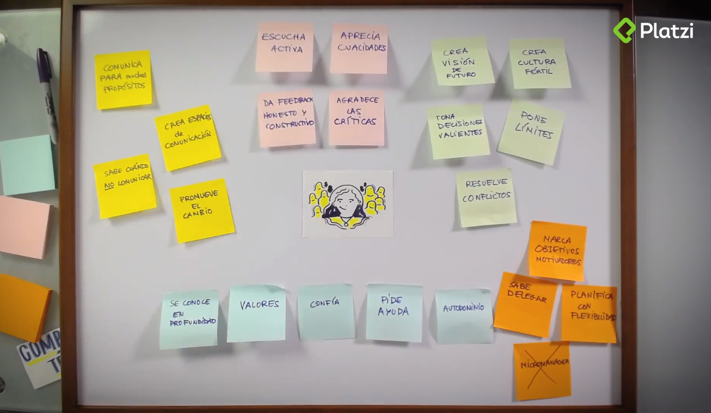

# Mapa de habilidades para liderar equiposwewe

Liderar tiene que ver con inspirar a las personas.

## Pregunta de reflexión

- **Pregunta:** Piensa en el/la mejor líder que hayas tenido, ¿qué hace que esa persona sea un/a gran líder?
- **Respuesta:** El escuchar a su equipo y hacerlos sentir que trabajan juntos y no para esta persona.

## Características de los grandes líderes

- Hacen sentir bien a las personas que trabajan con ellos
- Son únicos y actúan siguiendo valores propios
- Dominan un gran conjunto de habilidades y saben cuándo utilizarlas

## Mapa de habilidades para liderar equipos

<figure>
    
    <figcaption></figcaption>
</figure>

## Pregunta de reflexión

- **Pregunta:** ¿Qué tipo de habilidades tengo más desarrolladas? ¿Y menos?
- **Respuesta:**
    - **Más desarrolladas:**
        - Escucha activa
        - Aprecia cualidades
        - Toma decisiones valientes
        - Pone límites
        - Resuelve conflictos
        - Planifica con flexibilidad
        - No micromanager
        - Pide ayuda
        - Confía
        - Valores
        - Se conoce en profundidad
        - Comunica para muchos propósitos
        - Crea espacios de comunicación
        - Promueve el cambio.
    - **Menos desarrolladas:**
        - Da feedback honesto y constructivo
        - Agradece las críticas
        - Crea visión de futuro
        - Crea cultura fertil
        - Marca objetivos motivadores
        - Sabe delegar
        - Autodominio
        - Sabe cuánto no comunicar

> Los grandes líderes permiten que las personas de su equipo sean más expertas que ellos en las áreas técnicas.